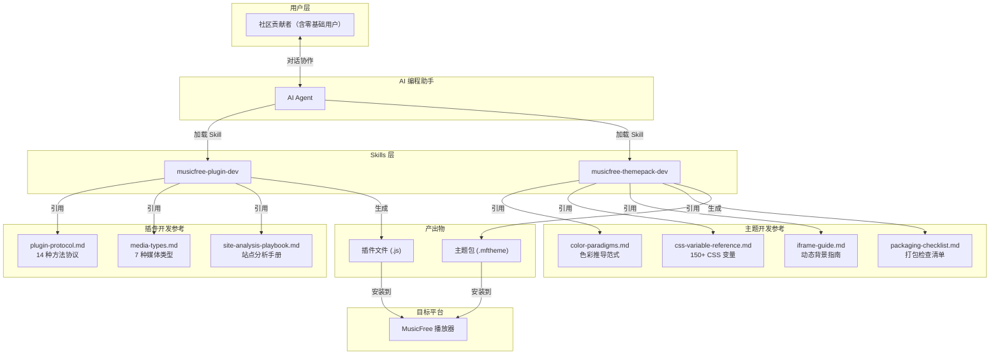
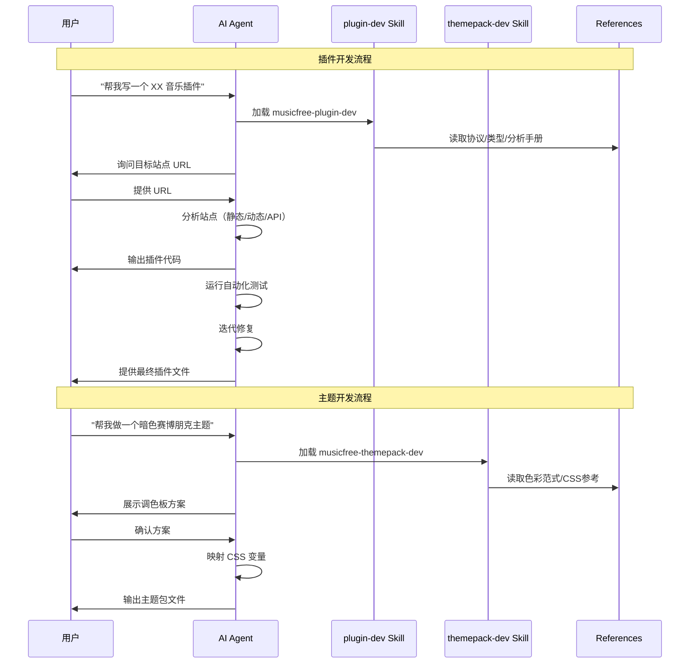

# MusicFree Skills 架构文档

## 概述

MusicFree Skills 是一个 AI Agent Skills 合集项目，专为开源音乐播放器 [MusicFree](https://github.com/maotoumao/MusicFree) 构建。该项目遵循 [Agent Skills](https://agentskills.io/) 标准格式，将 MusicFree 插件开发与主题包开发的专业知识封装为两个独立 Skill，供 AI 编程助手（如 Claude Code、Codex CLI 等）加载使用。

MusicFree 是一款支持插件化扩展的跨平台音乐播放器，用户可通过安装插件对接不同的音乐数据源（QQ音乐、网易云、酷狗等），通过安装主题包自定义界面外观。本项目将这两大扩展体系的开发规范、协议文档、分析方法和最佳实践组织为 Skill，使 AI 能够辅助社区贡献者（包括零编程基础用户）高效完成插件和主题开发。

项目以纯 Markdown 文档形式存在，无运行时代码和构建依赖。通过 `npx skills add maotoumao/musicfree-skills` 即可将 Skill 安装到本地 AI 编程环境。

## 技术栈

**语言与运行时**
- Markdown（Skill 指令与参考文档）
- JavaScript（沙箱环境下插件代码骨架，目标在于指导 AI 输出符合规范的插件代码）
- CSS Custom Properties（主题变量覆盖定义）

**Skill 标准**
- Agent Skills 格式（SKILL.md 主指令 + references/ 参考目录）

**目标平台**
- MusicFree 桌面版 / 移动版

**插件沙箱内置模块**
- axios — HTTP 请求（支持 stream）
- cheerio — HTML 解析与选择器
- crypto-js — 哈希与加密算法（MD5, SHA256, AES 等）
- dayjs — 日期处理
- big-integer — 大整数运算
- qs — URL 查询字符串解析
- he — HTML 实体编解码
- webdav — WebDAV 协议客户端

**主题底层技术**
- CSS Custom Properties（覆盖 MusicFree 内置变量）
- HTML5 Canvas 2D / WebGL（iframe 动态背景）
- CSS Animations（动态渐变背景）

## 项目结构

```
musicfree-skills/
├── README.md                    # 中文项目说明
├── README_en.md                 # 英文项目说明
├── LICENSE                      # GNU AGPL-3.0 许可证
└── skills/
    ├── musicfree-plugin-dev/    # 插件开发 Skill
    │   ├── SKILL.md             # 主指令（429 行）
    │   └── references/
    │       ├── plugin-protocol.md       # 14 种方法完整协议（532 行）
    │       ├── media-types.md           # 7 种媒体类型定义（133 行）
    │       └── site-analysis-playbook.md # 站点分析操作手册（463 行）
    └── musicfree-themepack-dev/ # 主题包开发 Skill
        ├── SKILL.md             # 主指令（300 行）
        └── references/
            ├── color-paradigms.md         # 色彩推导范式（120 行）
            ├── css-variable-reference.md   # CSS 变量完整参考（230 行）
            ├── iframe-guide.md             # iframe 动态背景指南（241 行）
            └── packaging-checklist.md      # 打包测试检查清单（122 行）
```

**Skill 目录约定**: 每个 Skill 包含一个 `SKILL.md`（主指令）和一个 `references/` 子目录（深度参考文档）。AI 加载 Skill 时会同时获取主指令和引用的参考文档。

## 子系统

### musicfree-plugin-dev（插件开发）

**目的**: 指导 AI 从零开发 MusicFree 音乐源插件，涵盖站点分析、接口逆向、代码生成和自动化测试的完整流程。

**位置**: `skills/musicfree-plugin-dev/`

**关键文件**: `SKILL.md`, `references/plugin-protocol.md`, `references/media-types.md`, `references/site-analysis-playbook.md`

**依赖**: Agent Skills 标准格式

**被依赖**: 由 AI 编程助手加载，辅助用户开发 MusicFree 插件

该 Skill 定义了严格的 AI 行为准则（禁止盲猜 URL、禁止批量探测、禁止搜索网络找 API 等），并通过 8 步工作流（收集信息 → 判断路径 → 分析数据源 → 实现循环 → 测试 → 修复 → 输出）确保插件开发质量。内置三种站点分析模式：公开 JSON API 对接、静态 HTML 解析（cheerio）、SPA 动态站点逆向（Playwright 网络捕获）。

### musicfree-themepack-dev（主题包开发）

**目的**: 指导 AI 辅助用户完成 MusicFree 主题包的色彩设计、CSS 变量映射、增强效果配置和打包测试。

**位置**: `skills/musicfree-themepack-dev/`

**关键文件**: `SKILL.md`, `references/color-paradigms.md`, `references/css-variable-reference.md`, `references/iframe-guide.md`, `references/packaging-checklist.md`

**依赖**: Agent Skills 标准格式

**被依赖**: 由 AI 编程助手加载，辅助用户开发 MusicFree 主题包

该 Skill 的核心设计理念是"MusicFree 主题包 = CSS Custom Properties 覆盖层"。通过 5 级覆盖等级（必须 > 建议 > 风格 > 慎重 > 禁止）规范 AI 对 150+ 个 CSS 变量的修改行为，并提供 4 种色彩推导范式帮助用户从模糊需求转化为具体色值。

## 架构图





## 设计决策

1. **双层文档架构**: 每个 Skill 采用"SKILL.md（操作手册）+ references/（参考手册）"结构。SKILL.md 包含行为准则和工作流程，references/ 提供深度技术细节。这种分层使 AI 能快速理解执行流程，在需要细节时再深入参考文档。

2. **AI 行为显式约束**: 两个 SKILL.md 均以严格的"行为准则"开头。插件开发禁止盲猜 URL、禁止搜索网络找 API、禁止批量探测等；主题开发强制"先确认再动手"、"视觉产物需用户确认"。这些约束确保 AI 在缺乏领域知识的任务中既不擅自猜测也不过度骚扰用户。

3. **零依赖纯文档项目**: 本项目无 package.json、无构建脚本、无可执行代码（SKILL.md 中的代码均为 AI 的参考骨架）。通过 Agent Skills 生态的标准分发机制（`npx skills add`）安装，完全由 Markdown 文档构成。

4. **最小操作原则**: 插件开发 Skill 强调"AI 主导、最小化用户操作"——用户仅需提供站点 URL 和响应确认，其余分析、实现、测试均由 AI 完成。主题开发 Skill 在视觉决策上采用"AI 建议、用户确认"的协作模式。
