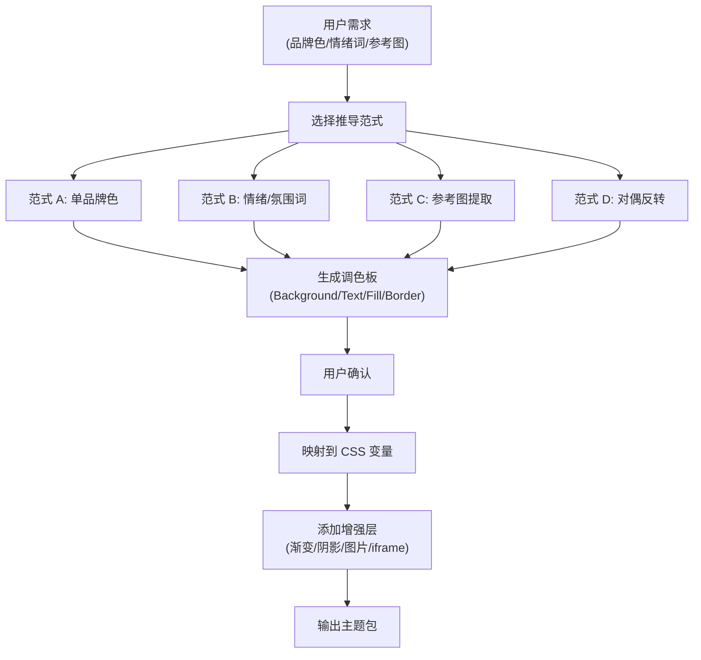
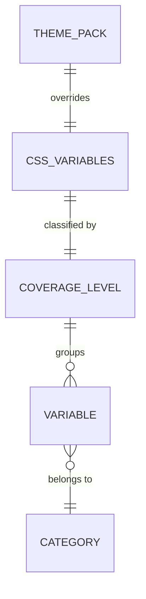

# CSS 变量体系

MusicFree 主题包通过覆盖 CSS Custom Properties 来改变播放器的视觉外观。约 150+ 个语义化 CSS 变量构成了一套完整的 UI 样式接口。

## 什么是 CSS 变量体系？

CSS 变量体系是 MusicFree 主题系统对外暴露的样式接口。MusicFree 所有 UI 组件的颜色、阴影、模糊、圆角等样式均通过 CSS 变量定义，主题包只需在 `:root {}` 选择器中覆盖这些变量即可改变整个应用的视觉风格。

**关键特征**:
- 变量命名遵循 `--musicfree-{category}-{name}` 约定
- 分 5 级覆盖等级：必须 > 建议 > 风格 > 慎重 > 禁止
- 涵盖 18 大类，共约 150+ 个变量
- 暗色主题以深色底+浅色字为基准，浅色主题以浅色底+深色字为基准的"对偶反转"

## 代码位置

| 方面 | 位置 |
|------|------|
| 变量完整参考 | `skills/musicfree-themepack-dev/references/css-variable-reference.md` |
| 色彩推导范式 | `skills/musicfree-themepack-dev/references/color-paradigms.md` |
| Skill 主指令 | `skills/musicfree-themepack-dev/SKILL.md` |

## 覆盖等级体系

### 必须覆盖（Must）

这些变量的缺失会导致明显的视觉不一致。在基础暗色主题中，包括：

| 类别 | 变量数 | 说明 |
|------|--------|------|
| Background | 11 | 背景色，按 UI 海拔递增 |
| Fill (品牌) | 3 | 主色调、悬停态、激活态 |
| Fill (中性) | 3 | 中性灰色调 |
| Text | 7 | 5 级灰度 + 强调色 + 补充色 |
| Border | 5 | 边框色，含 hover/focus 变体 |

### 建议覆盖（Recommended）

提升主题完整度和一致性：

| 类别 | 变量数 | 说明 |
|------|--------|------|
| Fill (弱填充) | 2 | 低强调背景填充 |
| Focus Ring | 2 | 键盘聚焦环颜色 |
| Status | 14 | 5 种状态各含底色/前景色/边框 |

### 风格覆盖（Stylistic）

特定视觉风格才需要覆盖：

| 类别 | 变量数 | 说明 |
|------|--------|------|
| Background Image | 1 | 全局背景图 |
| Shadow | 7 | 阴影颜色和尺寸 |
| Blur | 7 | 模糊效果 |
| Radius | 7 | 圆角尺寸 |

### 慎重覆盖（Caution）

改动可能破坏可读性或一致性：

| 类别 | 变量数 |
|------|--------|
| Typography | 29 |
| Control Sizes | 3 |

### 禁止覆盖（Forbidden）

覆盖会破坏 UI 功能：

| 类别 | 变量数 | 说明 |
|------|--------|------|
| Z-Index | 11 | 层级系统，覆盖会导致遮罩/弹窗显示异常 |
| Motion | 11 | 动效时长和缓动，覆盖会导致动画不协调 |
| Opacity | 6 | 透明度系统 |
| Layout | 6 | 布局尺寸 |
| Spacing | 15 | 间距系统 |
| Icon Sizes | 6 | 图标尺寸 |

## 不变量

1. **海拔递增原则**: Background 变量 `--musicfree-bg-0` 到 `--musicfree-bg-9` 应按 UI 海拔递增亮度或递减亮度，确保视觉层次
2. **品牌色一致性**: `fill-brand`、`text-emphasis`、`border-focus` 应使用同一品牌色系
3. **对比度要求**: 文字色与对应背景色之间应满足 WCAG AA 对比度标准（4.5:1）

## 色彩推导流程

## 关系

| 关联概念 | 关系 | 描述 |
|---------|------|------|
| 主题包 | 覆盖 | 主题包通过 `:root {}` 覆盖 CSS 变量 |
| 覆盖等级 | 分类 | 每个变量按风险等级分为 5 级 |
| 色彩推导 | 输入 | 色彩推导范式是变量值的生成方法 |
