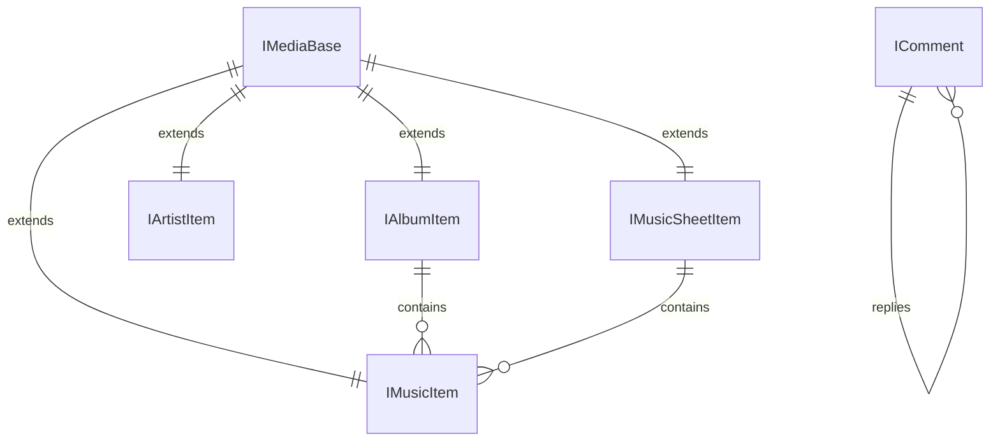

# 媒体类型

媒体类型定义了 MusicFree 插件中所有数据实体的结构。插件方法的返回值必须符合这些类型定义。

## 什么是媒体类型？

媒体类型是 MusicFree 插件系统的基础数据结构。歌曲、专辑、歌手、歌单、评论等在插件中都以标准化的接口形式表示，确保不同插件返回的数据能被 MusicFree 播放器统一处理和展示。

**关键特征**:
- 所有类型继承 `IMediaBase`（含 `id` 和 `platform` 字段）
- TypeScript 风格的接口定义（实际运行时为普通对象）
- 字段有必填/可选之分
- 支持嵌套结构（如 `IComment.replies`）

## 代码位置

| 方面 | 位置 |
|------|------|
| 类型定义 | `skills/musicfree-plugin-dev/references/media-types.md` |
| 协议引用 | `skills/musicfree-plugin-dev/references/plugin-protocol.md` |

## 类型清单

| 类型 | 用途 | 关键字段 |
|------|------|---------|
| `IMediaBase` | 所有类型的基类 | `id`, `platform` |
| `IMusicItem` | 歌曲 | `title`, `artist`, `album`, `artwork`, `duration` |
| `IAlbumItem` | 专辑 | `title`, `artist`, `artwork`, `date` |
| `IArtistItem` | 歌手 | `name`, `avatar`, `description` |
| `IMusicSheetItem` | 歌单 | `title`, `artwork`, `artist`, `playCount` |
| `IComment` | 评论 | `userName`, `content`, `replies` |
| `ILyricSource` | 歌词数据源 | `lyric`, `translation` |
| `IMusicSheetGroupItem` | 歌单分组 | `title`, `data` |

## 结构

### IMusicItem（核心类型）

```typescript
interface IMusicItem extends IMediaBase {
  title: string;        // 歌曲名（必填）
  artist: string;       // 歌手名（必填）
  artistId?: string;    // 歌手 ID
  album?: string;       // 专辑名
  albumId?: string;     // 专辑 ID
  artwork?: string;     // 封面图 URL
  duration?: number;    // 时长（秒）
  url?: string;         // 直接播放链接
  lrc?: string;         // 歌词文本
  quality?: {           // 多音质链接
    [key: string]: { url: string };
  };
}
```

### IComment（嵌套结构）

```typescript
interface IComment {
  id: string;              // 评论 ID
  userName: string;        // 用户名
  userAvatar?: string;     // 用户头像
  content: string;         // 评论内容
  time?: string;           // 时间
  likedCount?: number;     // 点赞数
  replies?: IComment[];    // 嵌套回复（递归）
}
```

## 不变量

1. **id 唯一性**: 同一 `platform` 内每个媒体资源的 `id` 必须唯一
2. **platform 一致性**: 插件内所有返回数据的 `platform` 字段必须一致
3. **嵌套上限**: `IComment.replies` 的递归深度不应超过实际数据层级

## 关系



| 关联概念 | 关系 | 描述 |
|---------|------|------|
| IMediaBase | 继承 | 所有媒体类型继承 IMediaBase |
| IComment | 自引用 | 评论通过 replies 字段嵌套回复 |
| IAlbumItem | 包含 | 专辑包含多首歌曲 |
| IMusicSheetItem | 包含 | 歌单包含多首歌曲 |
