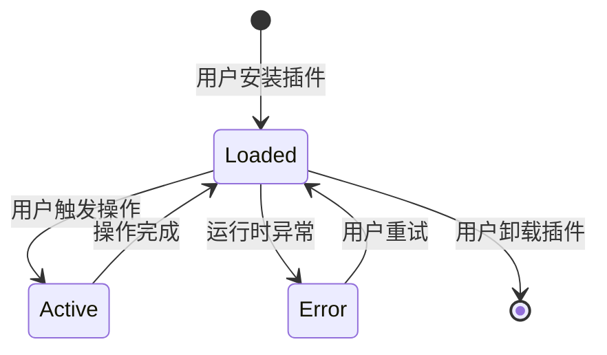
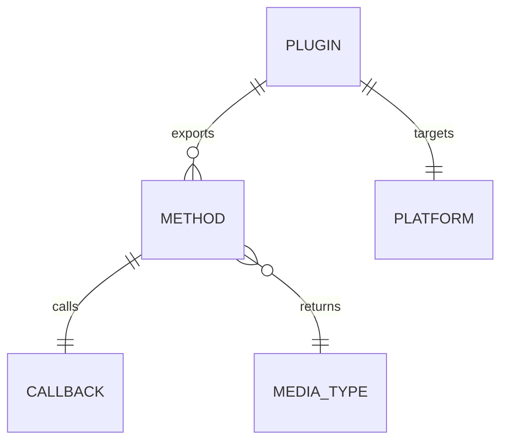

# 插件方法协议

插件方法协议定义了 MusicFree 插件运行时与插件代码之间的契约。每个插件是一个 CommonJS 模块，导出包含若干方法的对象。

## 什么是插件方法协议？

插件方法协议是 MusicFree 插件系统的核心接口规范。MusicFree 运行时根据用户操作（搜索、播放、查看详情等）调用插件中对应的方法，插件负责从目标音乐平台获取数据并返回符合规范的格式。

**关键特征**:
- 基于回调的异步模式（Node.js 风格 callback）
- 分页使用 page 参数（从 1 开始）
- 返回数据必须符合媒体类型定义
- 方法按需实现，不要求实现全部 14 种

## 代码位置

| 方面 | 位置 |
|------|------|
| 协议定义 | `skills/musicfree-plugin-dev/references/plugin-protocol.md` |
| 媒体类型 | `skills/musicfree-plugin-dev/references/media-types.md` |
| 站点分析方法 | `skills/musicfree-plugin-dev/references/site-analysis-playbook.md` |
| Skill 主指令 | `skills/musicfree-plugin-dev/SKILL.md` |

## 方法清单

| 方法 | 用途 | 必填 |
|------|------|------|
| `search` | 搜索歌曲/专辑/歌手/歌单 | 推荐 |
| `getMediaSource` | 获取歌曲播放链接 | 核心 |
| `getLyric` | 获取歌词（LRC 格式） | 推荐 |
| `getMusicInfo` | 获取歌曲详细元数据 | 可选 |
| `getAlbumInfo` | 获取专辑详情及曲目 | 可选 |
| `getMusicSheetInfo` | 获取歌单详情及曲目 | 可选 |
| `getArtistWorks` | 获取歌手作品列表 | 可选 |
| `importMusicItem` | 通过链接导入单曲 | 可选 |
| `importMusicSheet` | 通过链接导入歌单 | 可选 |
| `getTopLists` | 获取排行榜分类 | 可选 |
| `getTopListDetail` | 获取排行榜详情 | 可选 |
| `getRecommendSheetTags` | 获取推荐歌单标签 | 可选 |
| `getRecommendSheetsByTag` | 按标签获取推荐歌单 | 可选 |
| `getMusicComments` | 获取歌曲评论 | 可选 |

## 方法签名约定

所有方法遵循统一的签名模式：

```javascript
methodName(input, page, callback) {
  // 1. 从 input 提取参数
  // 2. 请求目标平台 API
  // 3. 映射为规范格式
  // 4. 调用 callback(error, result)
}
```

- `input`: 输入参数（query 字符串、musicItem 对象等）
- `page`: 页码，从 1 开始
- `callback`: `(error, result) => void`，error 为 null 表示成功

## 不变量

1. **回调必须被调用**: 每个方法最终必须调用 `callback`，否则播放器会永久等待
2. **错误不可抛出**: 所有错误必须通过 `callback(error)` 返回，不可 `throw`
3. **isEnd 标记正确**: 分页方法返回的 `isEnd` 必须准确，否则可能导致数据缺失或无限加载
4. **id 唯一性**: 同一平台内每个媒体资源的 `id` 必须唯一

## 生命周期



### 状态描述

| 状态 | 描述 | 允许的转换 |
|------|------|-----------|
| `Loaded` | 插件已加载，等待用户操作 | → Active, Error, [*] |
| `Active` | 正在执行某个方法 | → Loaded |
| `Error` | 方法执行异常 | → Loaded |

## 关系



| 关联概念 | 关系 | 描述 |
|---------|------|------|
| Method | 使用 | 每个方法使用回调模式返回结果 |
| MediaType | 返回 | 方法返回的数据必须符合媒体类型定义 |
| Platform | 对接 | 插件对接特定的音乐平台 |
